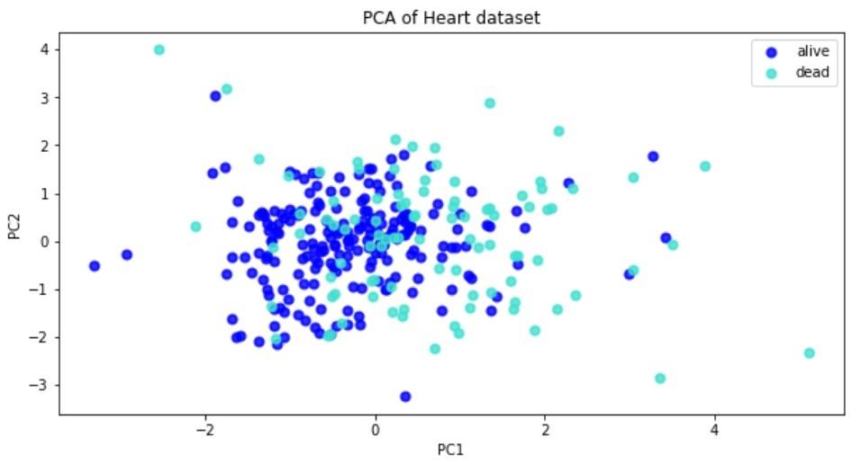

# Principal Component Analysis clustering of a Heart failure dataset.


The heart failure dataset from this article:
[Chicco, D., Jurman, G. Machine learning can predict survival of patients with heart failure from serum creatinine and ejection fraction alone. BMC Med Inform Decis Mak 20, 16 (2020).](https://doi.org/10.1186/s12911-020-1023-5).

 
## Installation instructions:
```install
git clone https://github.com/Simurgh818/Dabiri_unsupervised_clustering.git
```

### Requirements
This script was developed on a Windows machine with 7 core processor and 16 GB RAM. Although it is not a computationally heavy script and it ran fine on BMI cluster with 1 CPU core and 2 GB RAM.

## Description of scripts:
Once installed, the user can open the jupyter notebook called UnsupervisedClustering.ipynb to run the clustering. 
 

## Results

Below scatter plot shows the scatter plot of the two classes of Alive and Dead on their PC1 and PC2:



## Contributor
[Sina Dabiri](https://github.com/Simurgh818)
